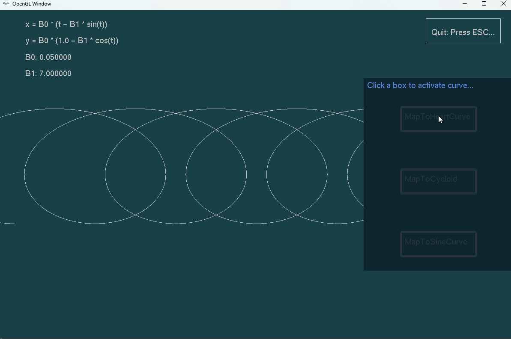

# 第二次作业
    要求：基于OpenGL创建显示窗口并且绘制优美的数学曲线。
## 环境说明
依赖 | 版本
--- |---
C++ | C++11以上
GLUT| 3.7.6
OpenGL| v3
glm | ——
stb_image| ——

## 程序说明
        程序界面如下方gif演示所示，主窗口绘制数学曲线，曲线公式在左上角，以及曲线对应的可调节参数，右侧中间有一个子窗口，可以通过点击不同按钮选绘制不同曲线，每个大按钮周围配有调节曲线参数的小按钮，与主窗口左上角的参数绑定，可以通过点击左边小按钮逐渐增大参数，点击右边小按钮缩小参数。
        最后可以按下ESC键退出程序。
> Demo

注：本演示视频在项目Videos文件夹下。
## 调试说明
        本项目build文件夹下有可执行程序（GLUT_Project.exe），可以直接在外部双击运行，按照上面说明调试。