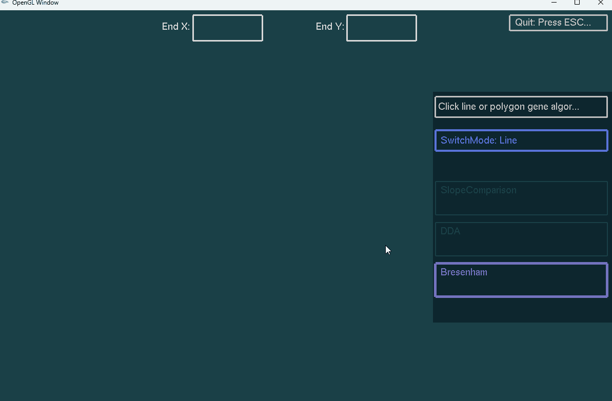

<!--
 * @Author: push-rush 1441488761@qq.com
 * @Date: 2024-04-27 08:47:20
 * @LastEditors: push-rush 1441488761@qq.com
 * @LastEditTime: 2024-04-27 08:47:36
 * @FilePath: /CourseWork3/README.md
 * @Description：CG第一次实验
-->
# 计算机图形学第一次上机实验
## 实验1
### 要求

### Demo

## 程序作业3
### 要求
实现基于种子点的区域填充算法。绘制图形，调用所实现的算法对图形指定区域进行填充。
### Demo

